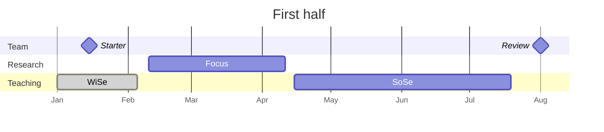

# 00 Goals

## Vision

Digital technologies drive fundamental transformation processes and create new possibilities in the organization and design of work. We aim to create a future where work is not only more productive and intelligent but also aligned with human well-being.

## Mission

We strive to:

- **Investigate the Futures of Work**: Conduct research within the context of digital work, exploring digital work practices and new organizational forms to uncover the dynamics of digital transformation and its societal implications.
- **Advance Recommendations and Collaboration**: Translate research findings into actionable insights while building partnerships with industry leaders, academic institutions, and communities to ensure our work is relevant and impactful.
- **Advance Education**: Provide high-quality, innovative education that equips future leaders with the skills to navigate and shape the digital landscape responsibly.
- **Promote Well-being and Ethics**: Advocate for the design of work environments that prioritize human-centric approaches and ethical considerations, ensuring that technological advancements benefit both organizations and their employees.

## Values

Our core values are:

## 🚀 **Impact in research, teaching, and practice**

We challenge ourselves every day to make significant contributions to research on digital work, inspiring students in different teaching formats, and facilitating the application of our work in practice.

## 🛠️ **Rigor, reliability, and reproducibility**

We value rigorous methods that are based on evidence and yield reproducible results. To this end, we select reliable tools and standard operating principles.

## ♻️ **Continuous improvement, openness, sustainability**

We aim to make our work processes, continuous improvement efforts, and outcomes openly accessible. In particular, we prefer open-source over proprietary technology.

<!-- https://www.heise.de/news/Bund-Lizenzkosten-fuer-Microsoft-auf-hohem-Niveau-insgesamt-neuer-Rekord-9744319.html -->

## 🙏 **Participation, support, and diversity**

We build a culture of support, encouraging the participation of different stakeholders, including current and former team members, students, and colleagues. We make diversity our strength.

## 🧑‍🎓️ **Learning**

We believe in continuous growth, setting aside time to learn on a regular basis, and curating helpful resources.

<details markdown="block">
  <summary>How we implement the values and goals</summary>
  1. What we emphasize during [onboarding]({{ site.baseurl }}/docs/10-lab/10_processes/10.32.onboarding.html)
  2. All of our teaching efforts follow the [*plan-do-check-adjust* cycle]({{ site.baseurl }}/docs/30-teaching/). Our [teaching evaluations]({{ site.baseurl }}/docs/30-teaching/30_processes/30.21.evaluations.html) and [improvements]({{ site.baseurl }}/docs/30-teaching/30_processes/30.22.improvements.html) are available publicly.
  3. We choose a rigorous manuscript production system, based on Git and Markdown. This allows us to involve students and research assistants in our most important projects, giving them the opportunity to learn and contribute from day one. Without the transparent versioning, reliable control, and effective contribution mechanisms of Git, we would probably "protect the manuscript" and restrict access to our work (e.g., when working with Word).
</details>

We pursue goals in the following areas:

- [Teaching]({{ site.baseurl }}/docs/30-teaching/30_processes/30.01.goals.html)
- [Research]({{ site.baseurl }}/docs/20-research/20_processes/20.01.goals.html)
- [Funding]({{ site.baseurl }}/docs/40-funding)
- [Service]({{ site.baseurl }}/docs/50-service)

<!-- https://handbook.gitlab.com/handbook/values/#how-do-we-reinforce-our-values -->

## Annual cadence

We organize our work in a cadence of **first half** and **second half** of the year, starting with the *starter* and *mid-year* planning session and concluding with the *end-of-year* session.



```mermaid
---
displayMode: compact
---
gantt
    title Second half
    dateFormat  YYYY-MM-DD
    todayMarker stroke-width:5px,stroke:red,opacity:0.8
    axisFormat %b

    section Team
    Review   :milestone, {{ site.time | date: "%Y" | plus: 1 }}-02-15, milestone
    Mid-year 🎯 :milestone, {{ site.time | date: "%Y" }}-07-01, milestone
    🎉 End-of-year  :b1, {{ site.time | date: "%Y" }}-12-10, milestone

    section Research
    Focus           :a2, {{ site.time | date: "%Y" }}-08-01, 60d
    
    section Teaching
    SoSe           :done, {{ site.time | date: "%Y" }}-06-15, 30d
    WiSe           :a2, {{ site.time | date: "%Y" }}-10-14, 65d
    WiSe           :a2, {{ site.time | date: "%Y" | plus: 1 }}-01-07, 30d
```

The agenda and meeting notes will be entered/linked here (along with links to our strategic / JF agenda)

- Review [security](10-lab/10_processes/10.72.security.html){: target="_blank"}

## Responsibilities

Team members work in selected sections, as summarized below.

|                               | Responsibilities | Main sections                                                                                                                                                                                                                                                                                                                                                                                                                   |
|-------------------------------|------------------|------------------------------------------------------------------------------------------------------------------------------------------------------------------------------------------------------------------------------------------------------------------------------------------------------------------------------------------------------------|
| Professor                     |                  | -  [10 Lab processes]({{ site.baseurl }}/docs/10-lab/10_processes/)<br> -  [20 Research processes]({{ site.baseurl }}/docs/20-research/20_processes/)<br> -  [30 Teaching processes]({{ site.baseurl }}/docs/30-teaching/30_processes/) <br>-  [30.02 Courses]({{ site.baseurl }}/docs/30-teaching/30_processes/30.02.courses.html)                                                                                                                                                                                                                                                                                            |
| Team assistant                | [Overview]({{ site.baseurl }}/docs/10-lab/10_processes/10.09.team_assistance.html)    | -  [10 Lab processes]({{ site.baseurl }}/docs/10-lab/10_processes/)<br> -  [30.02 Courses]({{ site.baseurl }}/docs/30-teaching/30_processes/30.02.courses.html)                                                                                                                                                                                                                                                                                             |
| PhD students                  |                  | -  [20 Research processes]({{ site.baseurl }}/docs/20-research/20_processes/)<br> -  [30 Teaching processes]({{ site.baseurl }}/docs/30-teaching/30_processes/)                                                                                                                                                                                                                                                                                              |
| Student assistants            |                  | -  [20 Research processes]({{ site.baseurl }}/docs/20-research/20_processes/) <br>-  [30 Teaching processes]({{ site.baseurl }}/docs/30-teaching/30_processes/)                                                                                                                                                                                                                                                                                                                                                              |
| All team members              |                  | -  [00 Goals]({{ site.baseurl }}/docs/00.goals.html)<br> -  [10.02 Org chart]({{ site.baseurl }}/docs/01.team.html)<br> -  [10.04 Standard operating procedures]({{ site.baseurl }}/docs/10-lab/10_processes/10.04.sop.html)<br> -  [10.05 Systems]({{ site.baseurl }}/docs/10-lab/10_processes/10.05.systems-overview.html)<br> -  [10.06 Resources]({{ site.baseurl }}/docs/10-lab/10_processes/10.06.resources.html)<br> -  [10.33 Vacation]({{ site.baseurl }}/docs/10-lab/10_processes/10.33.vacation.html)<br> -  [10.34 Development]({{ site.baseurl }}/docs/10-lab/10_processes/10.34.development.html)<br> |

- [Org chart: University](https://www.uni-bamberg.de/zuv/){: target="_blank"}

<!-- 
Team members and responsibilities (ideally with reference to specific categories)
other units
-->

{: .resource }
> Our agenda repositories on GitHub are [here](https://github.com/orgs/digital-work-lab/repositories?q=topic%3Aagenda){: target="_blank"}.
