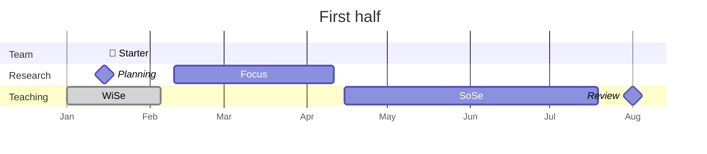

# 02 Calendar

We organize our work in a cadence of **first half** and **second half**



```mermaid
---
displayMode: compact
---
gantt
    title Second half
    dateFormat  YYYY-MM-DD
    todayMarker stroke-width:5px,stroke:red,opacity:0.8
    axisFormat %b

    section Team
    🎯 Mid-year :b1, {{ site.time | date: "%Y" }}-07-01, milestone
    🎉 End-of-year :b1, {{ site.time | date: "%Y" }}-12-18, milestone

    section Research
    Planning :milestone, {{ site.time | date: "%Y" }}-07-01, milestone
    Focus           :a2, {{ site.time | date: "%Y" }}-08-01, 60d
    
    section Teaching
    SoSe           :done, {{ site.time | date: "%Y" }}-06-15, 30d
    WiSe           :a2, {{ site.time | date: "%Y" }}-10-14, 75d
    WiSe           :a2, {{ site.time | date: "%Y" | plus: 1 }}-01-07, 30d
    Review   :milestone, {{ site.time | date: "%Y" | plus: 1 }}-02-15, milestone
```

Details will be added here (along with links to our strategic / JF agenda)

## Shared Calendar

Our shared internal/public calendar will be linked here.

## Agenda for starter/mid-year meeting

The agenda and meeting notes will be entered/linked here

- Review [security](10-lab/10_processes/10.72.security.html){: target="_blank"}

## Resources

- [Fristen/Termine](https://www.uni-bamberg.de/studium/im-studium/studienorganisation/vorlesungszeiten/){: target="_blank"}
