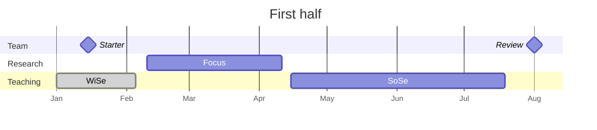

# 02 Calendar

Our shared public calendar has dates for upcoming events in the lab.

<iframe src="https://calendar.google.com/calendar/embed?src=32886c1c7f7b7e54aa97bd52173f7c811f1b9b8e519318e3f1bbfde98f856100%40group.calendar.google.com&ctz=Europe%2FBerlin" style="border: 0" width="100%" height="600" frameborder="0" scrolling="no"></iframe>

To subscribe directly, you can use the iCal link, which can be [added to Outlook](https://support.microsoft.com/en-us/office/import-calendars-into-outlook-8e8364e1-400e-4c0f-a573-fe76b5a2d379){: target="_blank"} or Thunderbird:

```
https://calendar.google.com/calendar/ical/32886c1c7f7b7e54aa97bd52173f7c811f1b9b8e519318e3f1bbfde98f856100%40group.calendar.google.com/public/basic.ics
```

## Annual cadence of first and second half

We organize our work in a cadence of **first half** and **second half** of the year, starting with the *starter* and *mid-year* planning session and concluding with the *end-of-year* session.



```mermaid
---
displayMode: compact
---
gantt
    title Second half
    dateFormat  YYYY-MM-DD
    todayMarker stroke-width:5px,stroke:red,opacity:0.8
    axisFormat %b

    section Team
    Review   :milestone, {{ site.time | date: "%Y" | plus: 1 }}-02-15, milestone
    Mid-year 🎯 :milestone, {{ site.time | date: "%Y" }}-07-01, milestone
    🎉 End-of-year  :b1, {{ site.time | date: "%Y" }}-12-10, milestone

    section Research
    Focus           :a2, {{ site.time | date: "%Y" }}-08-01, 60d
    
    section Teaching
    SoSe           :done, {{ site.time | date: "%Y" }}-06-15, 30d
    WiSe           :a2, {{ site.time | date: "%Y" }}-10-14, 65d
    WiSe           :a2, {{ site.time | date: "%Y" | plus: 1 }}-01-07, 30d
```

The agenda and meeting notes will be entered/linked here (along with links to our strategic / JF agenda)

- Review [security](10-lab/10_processes/10.72.security.html){: target="_blank"}

## Resources

- [Fristen/Termine](https://www.uni-bamberg.de/studium/im-studium/studienorganisation/vorlesungszeiten/){: target="_blank"}
