# 02 Calendar

We organize our work in a cadence of **first half** and **second half**

```mermaid
---
displayMode: compact
---
gantt
    title Second half
    dateFormat  YYYY-MM-DD
    todayMarker stroke-width:5px,stroke:red,opacity:0.8
    axisFormat %b
    section Teaching

    SoSe           :done, 2024-06-15, 30d
    WiSe           :a2, 2024-10-14, 75d
    WiSe           :a2, 2025-01-07, 30d
    Review   :milestone, 2025-02-15, milestone

    section Research
    Planning :milestone, 2024-07-01, milestone

    Focus           :a2, 2024-08-01, 60d

    section Team
    🎯 Mid-year :b1, 2024-07-01, milestone
    🎉 End-of-year :b1, 2024-12-18, milestone
```

Details will be added here (along with links to our strategic / JF agenda)

## Shared Calendar

Our shared internal/public calendar will be linked here.

## Resources

- [Fristen/Termine](https://www.uni-bamberg.de/studium/im-studium/studienorganisation/vorlesungszeiten/){: target="_blank"}
