# 10.04 Standard operating principles
{: .no_toc }

We rely on standard operating principles to make high-quality contributions to research, teaching, and practice.
These principles summarize effective methods for staying focused on priorities, organizing projects efficiently, and coordinating our efforts.

## Table of contents
{: .no_toc .text-delta }

- TOC
{:toc}

<!--
Each principle has one of the following states:

- **Core**: Fundamental principles that are essential to the team's success and should generally be adhered to.
- **Recommended**: Practices that are highly encouraged because they provide significant benefits but are not strictly necessary.
- **Experimental**: Ideas or practices currently under trial to assess their value and suitability for long-term adoption.

| **Principle**                                                               | **Status**  |
|-----------------------------------------------------------------------------|-------------|
| [Work sessions](#work-sessions)                                             | Core        |
| [Work protocol](#work-protocol)                                             | Recommended |
| [Share Deep Links](#sharing-with-deep-links)                                | Core        |
| [Organizing with Agendas](#organizing-with-agendas)                         | Recommended |


| **Team**                | [Sharing Contents and Research Results Effectively](#sharing-contents-and-research-results-effectively)        | Recommended |
| **Individually**        | [Optimize Tools and Processes](#optimizing-tools-and-processes)                                                | Recommended |
| **Team**                | [**Efficient and Well-Documented Meetings**](#efficient-and-well-documented-meetings)                                    | Recommended |
| **Team**                | [**Netiquette for Respectful and Effective Communication**](#netiquette-for-respectful-and-effective-communication)      | Mandatory   |
| **Team**                | [**Mentoring and Continuous Learning**](#mentoring-and-continuous-learning)                                              | Recommended |
| **Team**                | [**Effective Use of Channels and Media**](#effective-use-of-channels-and-media)                                          | Recommended |
-->

## Work sessions: Alternating between focused and group work

**Focused work**

Our most important resource is focused work. Everyone may have a slightly different recipe on how to "get into the zone".
The following may be helpful to experiment:

- Blocking time slots for focused work (e.g., in the morning), and switching off e-mail and phones.
- Using distraction blockers like [Freedom](https://freedom.to/){: target="_blank"} or [Forest](https://www.forestapp.cc/){: target="_blank"}
- Working with techniques like Getting-Things-Done (GTD), bullet-journaling, daily priority lists, or Pomodoro
- Taking time to recharge every day, work out, take vacations

<!-- e.g., OS/Codespace VM -->

**Group work**

- Regular co-working sessions
- Planning and review sessions (with hands-on)
- Knowledge-sharing sessions (e.g., on creating a revision strategy)

## Work protocol

Our goal is to work on shared repositories (courses, projects, agendas), which serve as a "single point of truth".
For example, there should always be a specific repository containing the current version of a research paper, along with the version history, ongoing work in branches or pull requests and open issues.
We try to avoid sending direct messages and documents as much as possible.
Collaborating in these repositories has many benefits: repositories provide context (clearly identifying the project, its history, ongoing work, and open issues), allow us to reduce direct messages (the cognitive effort to search for related documents and coordinate asynchronous work), and use scripts like Labot for automation.

{: .text-center}

```mermaid
flowchart LR

    subgraph task["III. Task"]
        U["Has it been done before?"] -->|check handbook documentation, prior issues, including closed ones, and discussion| J
        J{How specific is it?}
        J -->|open question, task with no or minimal changes| K["Open an issue"]
        J -->|Change with an initial suggestion| L["Open a pull-request"]
    end

    subgraph scope["II. What"]
        direction LR
        E{What is it?}
        E -->|general, procedural| F["Handbook"]
        E -->|general, knowledge, communication| G["work_hub (Knowledge management, discussion and team issues) 🔒"]
        E -->|specific| H["Teaching or research repository (?)"]
        E -->|individual| P["Agenda 🔒"]

    end

    subgraph confidentiality["I. Confidentiality"]
        direction LR
        B{Is it confidential?}
        B -->|yes| C["Private repository 🔒"]
        B -->|no| D["Private or public repository (?)"]
    end

    style task fill:white,stroke:#333,stroke-width:3px
    style scope fill:white,stroke:#333,stroke-width:3px
    style confidentiality fill:white,stroke:#333,stroke-width:3px
```


{: .highlight }
> TODO : add examples, link items in the figure

**GitHub issues for task management**

We use **one system** to manage tasks: GitHub (issues).
Issues offer a continuous thread for a given task with several advantages:

- All task-related information is collected in one place
- We can link other resources or upload files
- We can mention others (e.g., `@geritwagner`: can you help me with ...?), asking them to contribute
- We can work on shared issues with colleagues, but also with external stakeholders, such as researchers from other universities or students
- Issues can be linked to pull requests
- We can share (deep) links to issues, giving recipients context on the task (unlike e-mails where finding context can be time-consuming)
- GitHub offers templates to structure recurring tasks
- It is easy to write scripts that access, create, or contribute to issues
- Closed issues offer a historical record of past decisions and work procedures

Best practices:

- Carefully decide in which repository the issues should be created. Issues are specific to a repository and have the same visibility (private or public).
- Mention colleagues instead of writing a separate e-mail.
- Regularly check GitHub's overview of all [open issues assigned to you or with mentions](https://github.com/issues/assigned){: target="_blank"}

**Agendas**

To facilitate planning and collaboration, we work with agenda repositories.
An agenda repository is a shared GitHub repository with a README.md file to keep track of meeting notes, TODOs, and items to discuss.
It is one place to keep track of information that can be linked and edited by all participants.

Example repository: `https://github.com/digital-work-lab/agenda-adam-eva`

```
# Agenda: Adam - Eva

Regular meeting:

- Time: ...
- Location: ...

## Items to discuss

- item

## Log

### CW 1

- meeting note
```

### Sharing with deep links

A **deep link** is a URL that points directly to specific content within a page, rather than to the general page or document itself.
This allows users to access the exact information or context they need without having to navigate or search within the broader resource.

Examples of deep links:

- **Specific element in our handbook**:  
  `https://digital-work-lab.github.io/handbook/docs/20-research/20_processes/20.32.revision.html#expected-outcome`
- **Selected slide in our project**:  
  `https://digital-work-lab.github.io/open-source-project/output/05-best_practice.html#technical-setup`
- **A comment in an issue discussion**:  
  `https://github.com/digital-work-lab/digital-work-lecture/issues/8#issuecomment-2199793685`
- **TODO**: Calendar, People, Agenda

How to create a deep link:

- Click on the anchor and copy the URL:


- In slides, add the title after the `#`:


<details>
  <summary>Why Use Deep Links</summary>
  <ol>
    <li><strong>Precision and Clarity</strong>: 
        Deep links provide targeted access to relevant content, which reduces ambiguity and ensures recipients understand the exact context being referenced.
    </li>
    <li><strong>Improved Collaboration</strong>: 
        Sharing specific parts of documents or discussions encourages grounded and focused discussions, avoiding the inefficiency of reading or interpreting an entire document.
    </li>
    <li><strong>Asynchronous Workflows</strong>: 
        Deep links support modern collaborative practices by making resources easy to share, revisit, and update over time without additional explanation or redundant actions.
    </li>
    <li><strong>Enhanced Discoverability</strong>: 
        They create a networked "knowledge graph," allowing users to explore related information seamlessly through interconnected resources.
    </li>
    <li><strong>Time and Effort Savings</strong>: 
        By bypassing the need to search within a page, deep links save time for all collaborators.
    </li>
  </ol>
  <p>
    See Ben Balter's <a href="https://ben.balter.com/2015/11/18/tools-to-empower-open-collaboration/" target="_blank">post</a>.
  </p>
</details>

### Sharing contents and research results

- Work iteratively: Always write and Share bullet Points before writing paragraphs
- Agree on short names for research projects (e.g., BibDedupe, GitIntro). Short names should be related to the topic, not the target journal (avoid referring to "the MISQ paper")
- State dates  using the `YYYY-MM-DD` format to avoid ambiguity (use standard terminology and formats)
- To facilitate sharing, ensure that projects, contents, and processes are **linkable** and **editable** (e.g., in a thesis repository on GitHub, a link to the meeting notes can be shared, and thesis advisors can directly suggest modifications)
- Questions related to our processes etc. should be answered by sharing a link instead of answering the same question multiple times (e.g., [here](10.07.markdown.html#slides) are our guidelines for creating markdown slides) 
- Before the publication of results, research data (including code, interview data and manuscripts) should be kept private.
- Coordinate with your team on whether and when a shared repository will be available to the public and set a clear time frame to avoid misunderstandings.

## Resources

Gawande, A. (2010). Checklist manifesto, the (HB). Penguin Books India.

- [GitLab](https://handbook.gitlab.com/handbook/company/culture/all-remote/handbook-first/){: target="_blank"}: Handbook-first principle
