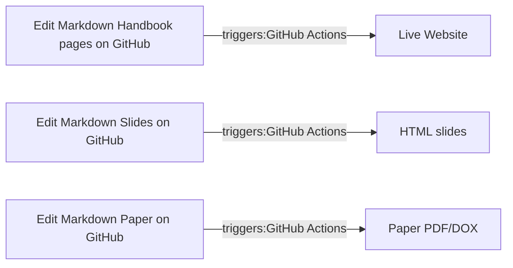

# 10.07 Markdown
{: .no_toc }

**[Markdown](https://www.markdownguide.org/){: target="_blank"}** is our preferred open-data format for the documentation (website), for writing papers and theses, managing knowledge, and creating slides. It is platform-independent, integrates well with git, and can easily be converted to other formats (e.g., PDF, HTML, DOCX) using [Pandoc](https://pandoc.org/){: target="_blank"}.



## Table of contents
{: .no_toc .text-delta }

- TOC
{:toc}

--- 

{: .highlight }
> **Guidelines**
> 
> - Each sentence should be in a new line (to ensure that the git diff is readable). To create a paragraph, add an empty line. This makes the history more readable and merging easier (see [semantic line breaks](https://sembr.org/){: target="_blank"}).

## Documentation

```
# Links that open in a separate window:
[name that displayed](https://website.com){: target="_blank"}

# References
<div class="references">
  <p>Author, A. A. (Year). Title of work: Capital letter also for subtitle. Publisher.</p>
</div>
```

Graphs can be included as [Mermaid diagrams](https://mermaid.js.org/syntax/flowchart.html){: target="_blank"}:

{: .text-center}
[Mermaid live editor](https://mermaid.live/edit){: .btn .btn-green target="_blank"}

## Papers, theses and books

A very useful possibility is to include comments throughout the markdown document:

```markdown
<!-- Comment can be used to add further explanations, links to references/resources, or to keep parts of the paper that were shortened -->
```

Papers are cited using the citation keys in the `references.bib` file and the citation syntax @Webster2002 or [@Webster2002].
Groups of in-text citations should be sorted alphabetically (especially if a prefix is used), i.e., use [e.g., @Bacharach1989; @Gregor2006a] instead of [e.g., @Gregor2006a; @Bacharach1989].

The syntax is based on the [citation syntax](https://pandoc.org/MANUAL.html#citation-syntax){: target="_blank"} (see [CSL](https://citationstyles.org/){: target="_blank"}).

To add papers that are cited in the figure to the reference section, include the following in the YAML header of paper.md:

```markdown
---
title: ...
author: ...
nocite: |
  @citation_key
---
```

Further Information on the [citation syntax](https://pandoc.org/MANUAL.html#citation-syntax){: target="_blank"} is available in the pandoc manual.

Figures can be included as follows and referred to as @fig:distribution.
Further information on [pandoc-crossref](https://lierdakil.github.io/pandoc-crossref/){: target="_blank"} is available online.

```markdown
{#fig:distribution width=300px}
```

To ensure compatibility with pandoc word and latex conversion, figures should be included as jpg/png.
For the final versions, vector graphics (PDF, EMF) should be included for Latex/Word respectively.

Formulas can be included as follows:

```latex
$$ P_i(x) = \sum_i a_i x^i $$ {#eq:eqn1}
```

Tables can be created with [GridTables](https://pandoc.org/MANUAL.html#extension-grid_tables){: target="_blank"} (which is displayed in PDF and Word documents):

```text
+---------------------+----------+
| Property            | Earth    |
+=============+=======+==========+
|             | min   | -89.2 °C |
| Temperature +-------+----------+
| 1961-1990   | mean  | 14 °C    |
|             +-------+----------+
|             | max   | 56.7 °C  |
+-------------+-------+----------+

Table: Findings {#tbl:findings}

We show the findings in @tbl:findings.
```

{: .text-center}
[Markdown table editor](https://www.tablesgenerator.com/markdown_tables){: .btn .btn-green target="_blank"}

Footnotes:

```text
Text with a footnote [^1].

  [^1]: Example footnote.
```

Information on references and citations is in [editing-markdown-paper](../../20-research/20_processes/20.29.writing.html) section.

Books: [bookdown](https://bookdown.org/yihui/bookdown/){: target="_blank"} project.

## Slides

- Open source Markdown-based presentation tool
- Creating slides with text, images, code blocks, diagrams, ...
- Exporting Presentations to many formats (HTML, PDF, ...)
- Speaker notes and presenter view during presentations
- CSS styling for customization
- Good integration with Git
- Template is available [here](https://github.com/digital-work-lab/slides){: target="_blank"}

Centered text:

```
<!-- _class: centered -->
```

Format references:

```
<style scoped>
p {
    padding-left: 36px;
    text-indent: -36px;
}
</style>

# References

Weritz, P. (2022). Hey leaders, It’s time to train the workforce: Critical skills in the digital workplace. *Administrative Sciences*, 12(3), 94. doi: [10.3390/admsci12030094](https://doi.org/10.3390/admsci12030094){: target="_blank"}.

```

## Exercise sheets

Jupyter notebooks are useful to create exercise sheets, combining Markdown with Python or R.

## Knowledge management

For knowledge management tasks, we use [Obsidian](https://obsidian.md/){: target="_blank"}.

- Each note (paper summary or concept) should be an a separate, **atomic note** (see [1](https://zettelkasten.de/overview/){: target="_blank"}, [2](https://forum.obsidian.md/t/12-principles-for-using-zettelkasten/51679){: target="_blank"}.
- Paper summaries should have the filename `citation_key.md`, with the *citation_key* corresponding to the ID in a BibTex file. 

## Resources

- [examples of Markdown application](https://bookdown.org/yihui/rmarkdown/basics-examples.html#airbnbs-knowledge-repository){: target="_blank"}
