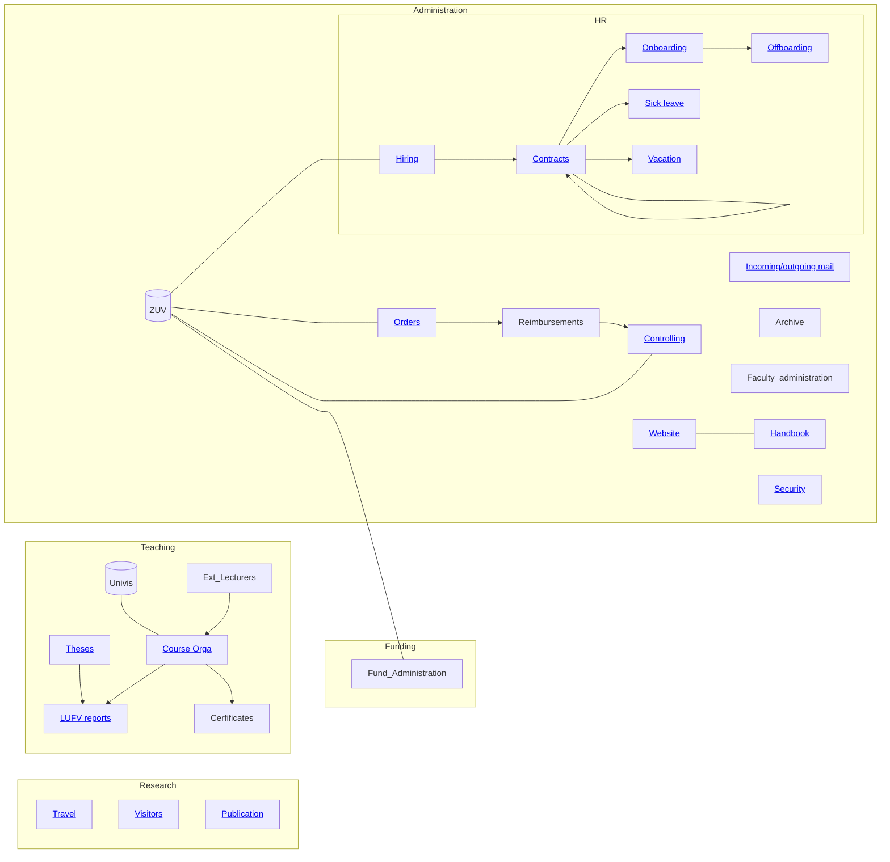

# 10.09 Team assistance

This page provides an overview of the main responsibilities of our team assistant.

## General tasks

- [Incoming & outgoing mail](10.51.mail.html), including first-Level-Support for students (office hours/ e-mail requests)
- [Employment contracts (creation, renewal, archiving)](10.31.contracts.html)
- [Prepare travel applications & travel expenses](10.50.travel.html)
- [Order office supplies](10.52.orders.html), e.g. paper, toner cartridges
- [Budget controlling](10.70.controlling.html#budget)
- Monitoring of deadlines:
  - FlexNOW (grades, planning of modules, changes in modules) , LUFV, exam supervision, ... 
  - List of deadlines UnivIS: [SoSe2024](https://vc.uni-bamberg.de/pluginfile.php/2337881/mod_resource/content/1/Terminplanung%20Sommersemester%202024.pdf)
  - [List of current and upcoming courses](../../30-teaching/30_processes/30.02.courses.html)
  
- [Homepage](10.11.website.html)

## Tasks regarding teaching

- [Module management](../../30-teaching/30_processes/30.09.new_modules.html) (entries in FlexNOW & UniviS, booking of rooms)
- [Theses](../../30-teaching/30_processes/30.40.theses.html) (topic confirmation -> send to examination office & archive; rewiews -> send to examination office)
- [Organizing lectures](../../30-teaching/30_processes/30.10.lecture.html) (preparation and postprocessing of exams, register "sham participants", order exam paper at in-house print shop (Mr. Stephan Hoh), provide necessary documents for exam supervisors, check corrected exams regarding points, find professor for second correction, enter grades in FlexNOW, send exam papers back to examination office)
- [Issue certificates ("Scheine")](../../30-teaching/30_processes/30.51.certificates.html) - End of semester
- [Prepare teaching reports (LUFV)](../../30-teaching/30_processes/30.20.reports.html) - End of semester

## Optional future tasks

- Reimbursement of expenses (e.g. licenses, case studies, which were paid with own credit card)
- External lectureship management (application at deanery, arrangement of lecture dates, room booking, transponder organizing, support with remuneration)
- Support with organising excursions 
- Appointment management for professor
- Application for and settlement of study grants
- [Recording of publications in FIS](../../20-research/20_processes/20.33.publication.html)

## Useful links

- [VC: Sekretariate WIAI](https://vc.uni-bamberg.de/course/view.php?id=58679){: target="_blank"}
- [VC: Infoportal Sekretariate](https://vc.uni-bamberg.de/course/view.php?id=12){: target="_blank"} (**Note**: the materials will be updated.)
