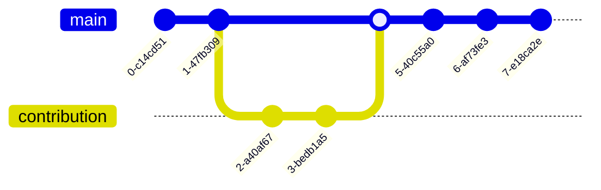

# 10.10 Handbook

This page explains how to contribute to the handbook.

## How to suggest changes

1. Navigate to the page you would like to change
2. Click on "Edit this page on GitHub", sign in, and the "Edit this file" button
3. Add your changes in [GitHub markdown](https://docs.github.com/de/get-started/writing-on-github/getting-started-with-writing-and-formatting-on-github/basic-writing-and-formatting-syntax){: target="_blank"}
4. Commit the changes to a new branch
5. Assign the maintainer to review and merge your changes

## Principles

- We prefer simple, structured, and actionable checklists
- Confidential data, such as grades and student identities should not be stored in the handbook
- Add links to other parts of the handbook or external resources to avoid replicating contents
- If the page requires scrolling, add a [table-of-content](https://just-the-docs.com/docs/navigation-structure/#in-page-navigation-with-table-of-contents){: target="_blank"}
- Avoid renaming files or changing the structure of directories. If files need to be renamed, include a redirect in the header:

```yaml
---
layout: default
title: ...
redirect_from:
  - /docs/20-research/20_processes/20.30.pre-submission.html
---

```

<!-- 
Note: who is responsible
-->

<!--
{: .highlight }
A paragraph highlighted as a warning

{: .text-center}
[VC](https://vc.uni-bamberg.de/course/view.php?id=58270){: .btn .btn-blue }
{: .text-center}

## Contributing via git



## Maintainers

| Section    | Maintained by |
|------------|---------------|
| 10-lab | [@geritwagner](https://github.com/geritwagner)  |
| research   | [@geritwagner](https://github.com/geritwagner)  |
| teaching   | [@geritwagner](https://github.com/geritwagner)  |

-->

## Deployment

The handbook is hosted on GitHub pages. The deployment may take a few minutes. You can check the status at 

{: .text-center}
[GitHub](https://github.com/digital-work-lab/handbook/actions){: .btn .btn-green target="_blank"}
{: .text-center}

## Linked resources

- [HDRUK PhD page](https://cwcyau.github.io/hdruk-phd-handbook/){: target="_blank"}
- [TeachingWiki Hannah Bast](https://ad-wiki.informatik.uni-freiburg.de/teaching){: target="_blank"}
