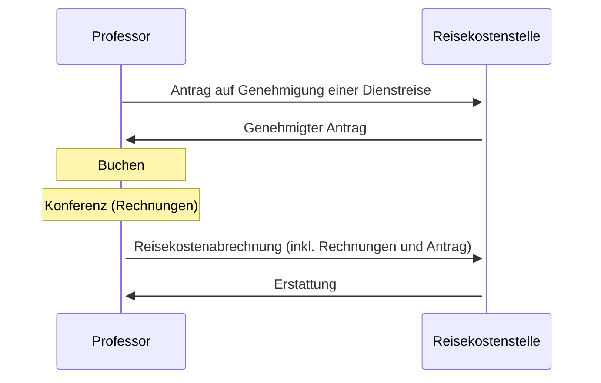

# 10.50 Travel
{: .no_toc }

## Table of contents
{: .no_toc .text-delta }

- TOC
{:toc}

## Overview

## Travel request

- Create a new folder in [13 travel](https://nc-2272638881871040784.nextcloud-ionos.com/index.php/apps/files/?dir=/10-lab/13_travel&fileid=61){: target="_blank"} with a new ID (range: 13.001-13.999).
- Fill out the [travel request](https://www.uni-bamberg.de/fileadmin/abt-personal/Homepage_ab_2016-03/11_Formulare_Infos_Merkblaetter/Reisekosten/Antrag_auf_Genehmigung_einer_Dienstreise.pdf)
- Air travel restrictions must be considered, in particular for short flights (2024-03-07_Rundschreiben Genehmigung von Flugreisen.pdf)

## Confirmation

- Remains at the secretary's office until reimbursement.

## Travel

- Collect receipts for expenses.

## Reimbursement of expenses

- Fill out the [reimbursement form](https://www.uni-bamberg.de/fileadmin/abt-personal/Homepage_ab_2016-03/11_Formulare_Infos_Merkblaetter/Reisekosten/Reisekostenabrechnung-10-17.docx).
- Attach the confirmation.
- Scan the documents and store in the 13.XXX folder.
- Send the form to the travel expense office.
