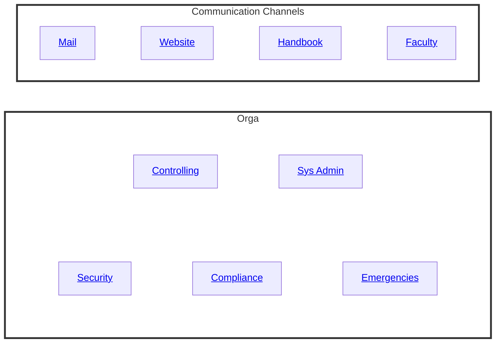
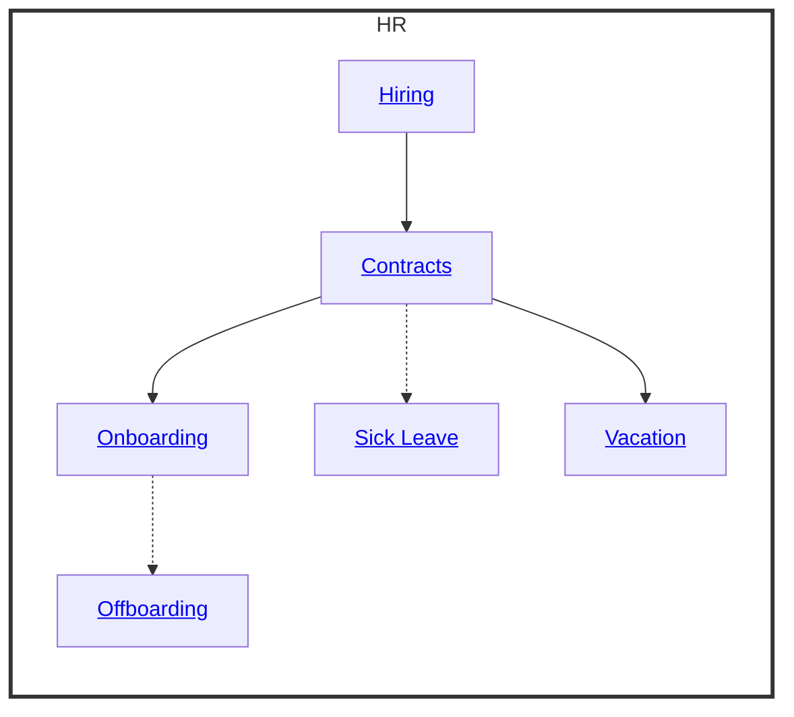
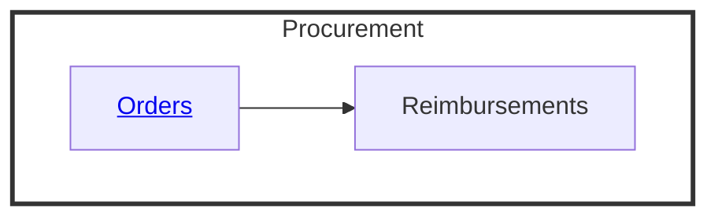
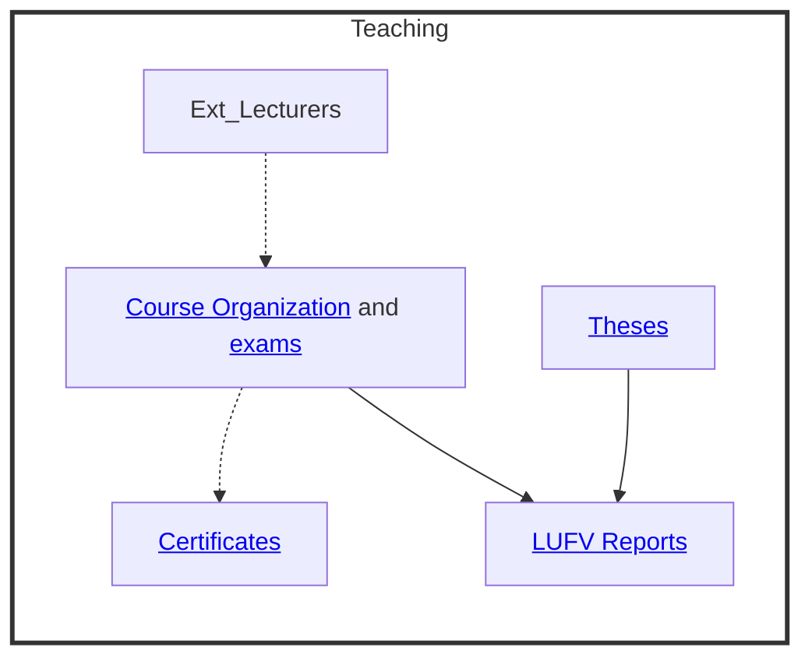
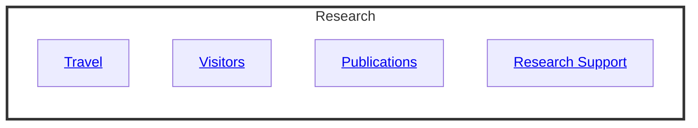

# Lab Management

{: .text-center}

```mermaid
flowchart  LR

    subgraph Orga
        direction LR
        subgraph a1[" "]
            direction LR
            Security["<a href='10_processes/10.72.security.html'>Security</a>"] ~~~ Compliance["<a href='10_processes/10.71.compliance.html'>Compliance</a>"] ~~~ Emergencies["<a href='10_processes/10.73.emergencies.html'>Emergencies</a>"]
        end
        subgraph a2["  "]
            direction LR
            Controlling["<a href='10_processes/10.70.controlling.html'>Controlling</a>"] ~~~ Administration["<a href='10_processes/10.90.administration.html'>Sys Admin</a>"]
        end
    end

    subgraph Connecting["Communication Channels"]
        direction LR
        Mail["<a href='10_processes/10.51.mail.html'>Mail</a>"] ~~~ Website["<a href='10_processes/10.11.website.html'>Website</a>"] ~~~ Handbook["<a href='10_processes/10.10.handbook.html'>Handbook</a>"] ~~~ Faculty["<a href='10_processes/10.60.faculty.html'>Faculty</a>"]
    end

    style Orga fill:white,stroke:#333,stroke-width:3px
    style Connecting fill:white,stroke:#333,stroke-width:3px
    style a1 fill:white,stroke:white
    style a2 fill:white,stroke:white  
```

{: .text-center}

```mermaid
flowchart  TB

    subgraph HR
        direction TB
        Hiring["<a href='10_processes/10.30.hiring.html'>Hiring</a>"] --> Contracts["<a href='10_processes/10.31.contracts.html'>Contracts</a>"]
        Contracts --> Onboarding["<a href='10_processes/10.32.onboarding.html'>Onboarding</a>"]
        Contracts -.-> Sick_leave["<a href='10_processes/10.35.sick_leave.html'>Sick Leave</a>"]
        Contracts --> Vacation["<a href='10_processes/10.33.vacation.html'>Vacation</a>"]
        Onboarding -.-> Offboarding["<a href='10_processes/10.39.offboarding.html'>Offboarding</a>"]
    end

    style HR fill:white,stroke:#333,stroke-width:3px
```

{: .text-center}

```mermaid
flowchart  TB

    subgraph Procurement
        direction LR
        Orders["<a href='10_processes/10.52.orders.html'>Orders</a>"] --> Reimbursements
    end

    style Procurement fill:white,stroke:#333,stroke-width:3px
```

{: .text-center}

```mermaid
flowchart  TB

    subgraph Teaching
        direction TB
        Ext_Lecturers -.-> Course_Orga["<a href='../30-teaching/30_processes/30.02.courses.html'>Course Organization</a> and <a href='../30-teaching/30_processes/30.59.exams.html'>exams</a>"]
        Course_Orga -.-> Certificates["<a href='../30-teaching/30_processes/30.51.certificates.html'>Certificates</a>"]
        Course_Orga --> LUFV["<a href='../30-teaching/30_processes/30.20.reports.html'>LUFV Reports</a>"]
        Theses["<a href='../30-teaching/30_processes/30.40.theses.html'>Theses</a>"] --> LUFV
    end

    style Teaching fill:white,stroke:#333,stroke-width:3px
```

{: .text-center}

```mermaid
flowchart  LR

    subgraph Research
        direction TB
        Travel["<a href='10_processes/10.50.travel.html'>Travel</a>"]
        Visitors["<a href='10_processes/10.53.visitors.html'>Visitors</a>"]
        Publications["<a href='../20-research/20_processes/20.33.publication.html'>Publications</a>"]
        Support["<a href='../20-research/20_processes/20.23.research-support.html'>Research Support</a>"]
    end

    style Research fill:white,stroke:#333,stroke-width:3px
```
