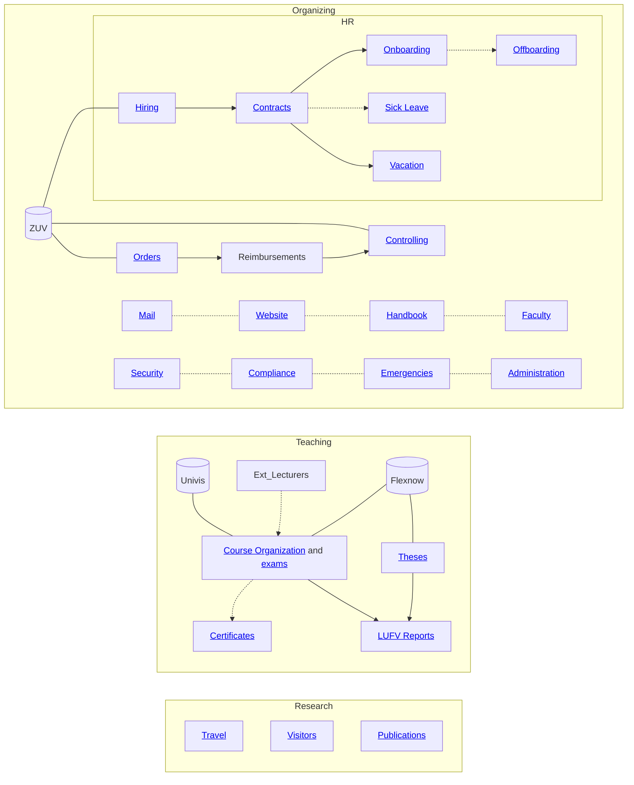

# Lab Management

```mermaid
flowchart  LR

    subgraph Research
        Travel["<a href='10_processes/10.50.travel.html'>Travel</a>"]
        Visitors["<a href='10_processes/10.53.visitors.html'>Visitors</a>"]
        Publications["<a href='../20-research/20_processes/20.33.publication.html'>Publications</a>"]
    end

    subgraph Teaching
        direction TB
        Univis[(Univis)]
        Flexnow[(Flexnow)]
        Ext_Lecturers -.-> Course_Orga["<a href='../30-teaching/30_processes/30.02.courses.html'>Course Organization</a> and <a href='TODO'>exams</a>"]
        Course_Orga -.-> Certificates["<a href='../30-teaching/30_processes/30.51.certificates.html'>Certificates</a>"]
        Flexnow --- Course_Orga
        Flexnow --- Theses
        Course_Orga --> LUFV["<a href='../30-teaching/30_processes/30.20.reports.html'>LUFV Reports</a>"]
        Theses["<a href='../30-teaching/30_processes/30.40.theses.html'>Theses</a>"] --> LUFV
        Univis --- Course_Orga
    end

    subgraph Organizing
        direction LR

        Mail["<a href='10_processes/10.51.mail.html'>Mail</a>"] -.- Website["<a href='10_processes/10.11.website.html'>Website</a>"] -.- Handbook["<a href='10_processes/10.10.handbook.html'>Handbook</a>"] -.- Faculty["<a href='10_processes/10.60.faculty.html'>Faculty</a>"]
        Orders["<a href='10_processes/10.52.orders.html'>Orders</a>"] --> Reimbursements

        
        subgraph HR
            direction TB
            Hiring["<a href='10_processes/10.30.hiring.html'>Hiring</a>"] --> Contracts["<a href='10_processes/10.31.contracts.html'>Contracts</a>"]
            Contracts --> Onboarding["<a href='10_processes/10.32.onboarding.html'>Onboarding</a>"]
            Contracts -.-> Sick_leave["<a href='10_processes/10.35.sick_leave.html'>Sick Leave</a>"]
            Contracts --> Vacation["<a href='10_processes/10.33.vacation.html'>Vacation</a>"]
            Onboarding -.-> Offboarding["<a href='10_processes/10.39.offboarding.html'>Offboarding</a>"]
        end
        ZUV[(ZUV)]
        ZUV --- Controlling
        ZUV --- Orders
        ZUV --- Hiring
        Reimbursements --> Controlling["<a href='10_processes/10.70.controlling.html'>Controlling</a>"]
        Security["<a href='10_processes/10.72.security.html'>Security</a>"] -.- Compliance["<a href='10_processes/10.71.compliance.html'>Compliance</a>"] -.- Emergencies["<a href='10_processes/10.73.emergencies.html'>Emergencies</a>"] -.- Administration["<a href='10_processes/10.90.administration.html'>Administration</a>"]
    end

```