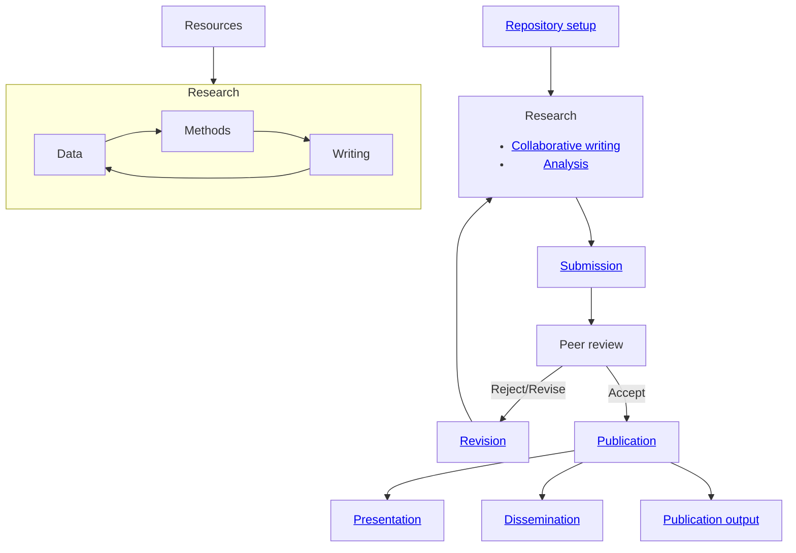

# 20.02 Standard operating procedures

## Processes

TODO: Cover Research data management, reproducibility (but check with the team befor publishing data - make sure confidential data is protected)

# Principles

- Use [Markdown](../../10-lab/10_processes/10.07.markdown.html) for manscripts, presentations, and knowledge management
- Use Git to version, collaborate, and share

The principles are reflected in the [paper template](20.20.paper-templates.html), the presentation template (TODO), and the [thesis template](https://github.com/digital-work-lab/thesis-template).

