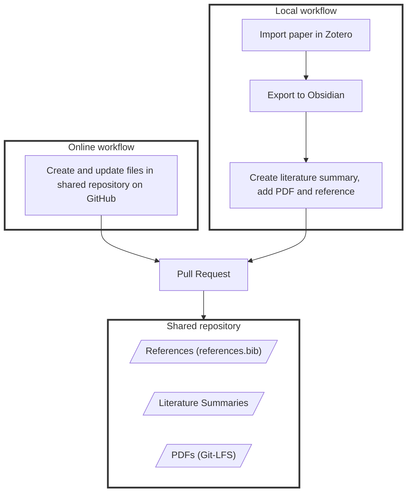

# 22 Literature (shared)
{: .d-inline-block }

## Shared repository

Git repository with

- References: `references.bib` in Git repository
- PDFs: Git-LFS
- Obsidian literature summaries
- If Word integration (citation plugin) is needed: Zotero (for individual projects)

## Local workflow

Zotero can be used (recommended) to facilitate the export to the repository

- Quick export - with [Zotero connector](https://chromewebstore.google.com/detail/zotero-connector/ekhagklcjbdpajgpjgmbionohlpdbjgc){: target="_blank"} for web exports, [Zotero integration](https://github.com/mgmeyers/obsidian-zotero-integration){: target="_blank"} and [Obsidian Web Clipper](https://obsidian.md/clipper){: target="_blank"} for web export

**TODO**

- How to export PDFs efficiently / add the record to the references
- TBD: PDF Commenting (Zotero??)

## Online workflow

No setup is required.

**TODO**: Create concept notes with a script (not manually with obsidian/Zotero?)

## Pull request

**TODO**: Labot support for pull-requests

{: .highlight }
> **IMPORTANT**
> All contents, including the references, literature summaries, and PDFs, should be versioned in Git, carefully crafted and controlled to ensure high quality. 

Example repository: [work_hub](https://github.com/digital-work-lab/work_hub)

**TODO**:

- Update repo setup: include Git-LFS
- Existing projects: Move PDFs to git repositories with Git-LFS [Nextcloud](https://nc-2272638881871040784.nextcloud-ionos.com/index.php/apps/files/?dir=/22-literature/23_data&fileid=88094){: target="_blank"} in sections 25 and 36.
- TBD: CoLRev repositories (PDFs and obsidian vaults)

{: .resource } 
> - [GitHub](https://github.com/orgs/digital-work-lab/repositories?q=topic%3Aresearch){: target="_blank"}
