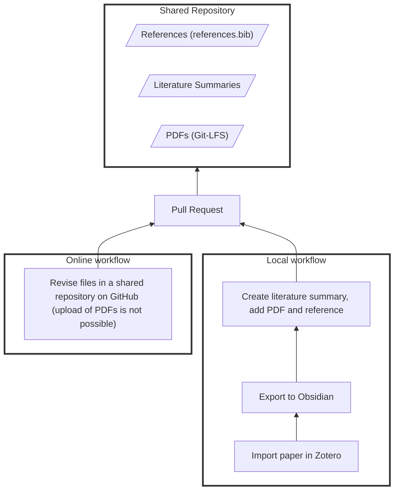

# 22 Literature (shared)
{: .d-inline-block }

## Books (Physical Library)

See [library]({{ site.baseurl }}/docs/10-lab/18_resources/18.01.library.html)

## Journals and Conferences

We collect PDFs from key IS journals and conferences. This is essential for full-text searching (see [tools]({{ site.baseurl }}/docs/20-research/20_processes/20.03.systems.html#2003-systems-for-research)) and retrieval (e.g., using CoLRev).

{: .resource } 
> A selection of journal and conference papers is available [on Nextcloud](https://nc-2272638881871040784.nextcloud-ionos.com/index.php/apps/files/files/373460?dir=/20-research/22_literature){: target="_blank"}.

{: .info } 
> Note: only download conference proceedings/issues when they are complete.

Overview of journals:

<!-- labot local-cronjob -->

| Curation | Type | Latest in records.bib | Latest in data/pdfs | Status |
|----------|------|------------------------|---------------------|--------|
| americas-conference-on-information-systems | conference | 2024 | 2025 | ✅ Up-to-date |
| communications-of-the-association-for-information-systems | journal | 57 | 57 | ✅ Up-to-date |
| decision-support-systems | journal | 187 | 195 | ✅ Up-to-date |
| european-conference-on-information-systems | conference | 2025 | 2025 | ✅ Up-to-date |
| european-journal-of-information-systems | journal | 33_2 | 34_4 | ✅ Up-to-date |
| hawaii-international-conference-on-system-sciences | conference | 2023 | 2024 | ✅ Up-to-date |
| information-and-management | journal | 61_7 | 62_6 | ✅ Up-to-date |
| information-systems-frontiers | journal | 26_1 | 27_3 | ✅ Up-to-date |
| information-systems-journal | journal | 34_1 | 35_4 | ✅ Up-to-date |
| information-systems-research | journal | 34_3 | 36_2 | ✅ Up-to-date |
| international-conference-on-information-systems | conference | 2024 | 2024 | ✅ Up-to-date |
| journal-of-information-systems-education | journal | 36_3 | 36_4 | ✅ Up-to-date |
| journal-of-information-technology | journal | 38_2 | 40_2 | ✅ Up-to-date |
| journal-of-management-information-systems | journal | 40_4 | 42_2 | ✅ Up-to-date |
| journal-of-the-association-for-information-systems | journal | 26_5 | 26_5 | ✅ Up-to-date |
| mis-quarterly | journal | 48_4 | 49_2 | ✅ Up-to-date |
| pacific-asia-conference-on-information-systems | conference | 2025 | 2025 | ✅ Up-to-date |
| the-journal-of-strategic-information-systems | journal | 33_1 | 34_3 | ✅ Up-to-date |

<!-- END -->

## Literature Summaries

### Shared repository

Git repository with

- References: `references.bib` in Git repository
- PDFs: Git-LFS (add locally) - **PDFs cannot be uploaded online - must use the local cli for git-lfs**
- Obsidian literature summaries
- If Word integration (citation plugin) is needed: Zotero (for individual projects)

<!-- 
### Local workflow

Zotero can be used (recommended) to facilitate the export to the repository

- Quick export - with [Zotero connector](https://chromewebstore.google.com/detail/zotero-connector/ekhagklcjbdpajgpjgmbionohlpdbjgc){: target="_blank"} for web exports, [Zotero integration](https://github.com/mgmeyers/obsidian-zotero-integration){: target="_blank"} and [Obsidian Web Clipper](https://obsidian.md/clipper){: target="_blank"} for web export

**TODO**

- How to export PDFs efficiently / add the record to the references
- TBD: PDF Commenting (Zotero??)

## Online workflow

- No setup is required.
- Uploading PDFs to git-lfs is not possible.

**TODO**: Create concept notes with a script (not manually with obsidian/Zotero?)

**TODO**:

- Zotero vs. JabRef?
- Update repo setup: include Git-LFS
- Existing projects: Move PDFs to git repositories with Git-LFS [Nextcloud](https://nc-2272638881871040784.nextcloud-ionos.com/index.php/apps/files/?dir=/22-literature/23_data&fileid=88094){: target="_blank"} in sections 25 and 36.
- TBD: CoLRev repositories (PDFs and obsidian vaults)
 -->

**Pull request**: Labot support is enabled for pull requests (e.g., checking consistency, updating references).

Example repository: [work_hub](https://github.com/digital-work-lab/work_hub){: target="_blank"}

  <iframe src="https://www.youtube-nocookie.com/embed/7zE5i0WrLko"
          frameborder="0" allowfullscreen
          style="position:absolute; top:0; left:0; width:100%; height:100%;">
  </iframe>

## References

- [Obsidian for academic workflows](https://publish.obsidian.md/hub/04+-+Guides%2C+Workflows%2C+%26+Courses/for+Academic+Writing){: target="_blank"}

{: .resource } 
> - [GitHub](https://github.com/orgs/digital-work-lab/repositories?q=topic%3Aresearch){: target="_blank"}
