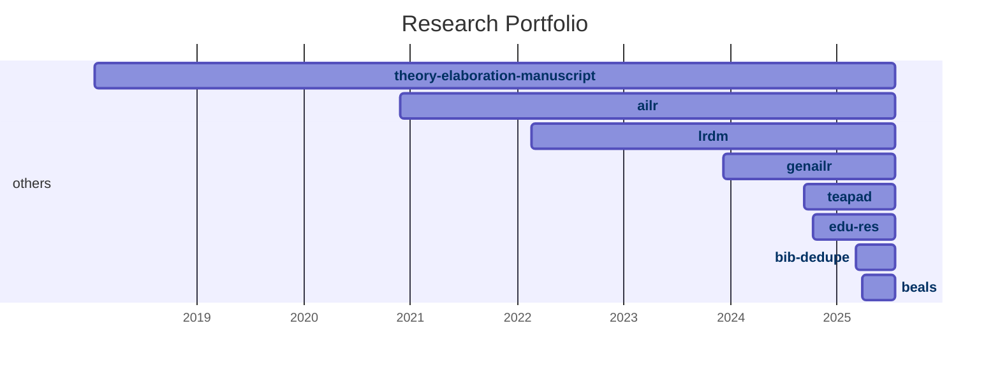

{: .text-center}

```mermaid
---
displayMode: compact
---
gantt
title Research Portfolio
dateFormat YYYY-MM-DD
axisFormat %Y

    section work_practices

    section distributed_organizing

    section knowledge_synthesis

    section others
        beals :beals, 2025-03-28, 2025-07-18
        bib-dedupe :bib-dedupe, 2025-03-04, 2025-07-18
        edu-res :edu-res, 2024-10-10, 2025-07-18
        teapad :teapad, 2024-09-10, 2025-07-18
        genailr :genailr, 2023-12-10, 2025-07-18
        lrdm :lrdm, 2022-02-20, 2025-07-18
        ailr :ailr, 2020-11-26, 2025-07-18
        theory-elaboration-manuscript :theory-elaboration-manuscript, 2018-01-15, 2025-07-18


    click beals href "{{ site.baseurl }}/docs/10-lab/18-resources/beals.html"
    click bib-dedupe href "{{ site.baseurl }}/docs/10-lab/18-resources/bib-dedupe.html"
    click edu-res href "{{ site.baseurl }}/docs/10-lab/18-resources/edu-res.html"
    click teapad href "{{ site.baseurl }}/docs/10-lab/18-resources/teapad.html"
    click genailr href "{{ site.baseurl }}/docs/10-lab/18-resources/genailr.html"
    click lrdm href "{{ site.baseurl }}/docs/10-lab/18-resources/lrdm.html"
    click ailr href "{{ site.baseurl }}/docs/10-lab/18-resources/ailr.html"
    click theory-elaboration-manuscript href "{{ site.baseurl }}/docs/10-lab/18-resources/theory-elaboration-manuscript.html"
```
