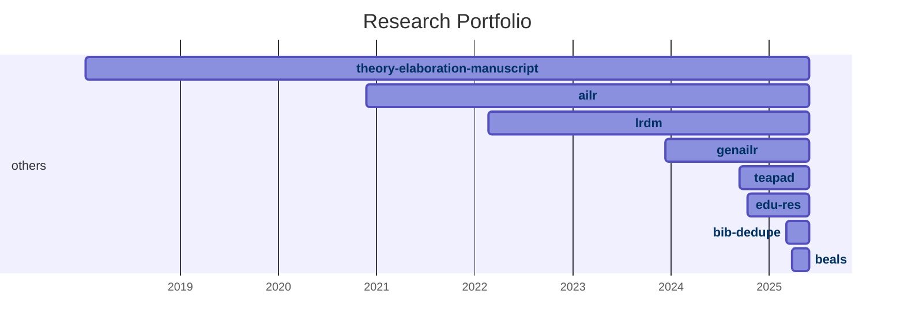

{: .text-center}

```mermaid
---
displayMode: compact
---
gantt
title Research Portfolio
dateFormat YYYY-MM-DD
axisFormat %Y

    section work_practices

    section distributed_organizing

    section knowledge_synthesis

    section others
        beals :beals, 2025-03-28, 2025-05-29
        bib-dedupe :bib-dedupe, 2025-03-04, 2025-05-29
        edu-res :edu-res, 2024-10-10, 2025-05-29
        teapad :teapad, 2024-09-10, 2025-05-29
        genailr :genailr, 2023-12-10, 2025-05-29
        lrdm :lrdm, 2022-02-20, 2025-05-29
        ailr :ailr, 2020-11-26, 2025-05-29
        theory-elaboration-manuscript :theory-elaboration-manuscript, 2018-01-15, 2025-05-29


    click beals href "{{ site.baseurl }}/docs/20-research/25-projects/_repos/beals"
    click bib-dedupe href "{{ site.baseurl }}/docs/20-research/25-projects/_repos/bib-dedupe"
    click edu-res href "{{ site.baseurl }}/docs/20-research/25-projects/_repos/edu-res"
    click teapad href "{{ site.baseurl }}/docs/20-research/25-projects/_repos/teapad"
    click genailr href "{{ site.baseurl }}/docs/20-research/25-projects/_repos/genailr"
    click lrdm href "{{ site.baseurl }}/docs/20-research/25-projects/_repos/lrdm"
    click ailr href "{{ site.baseurl }}/docs/20-research/25-projects/_repos/ailr"
    click theory-elaboration-manuscript href "{{ site.baseurl }}/docs/20-research/25-projects/_repos/theory-elaboration-manuscript"
```
