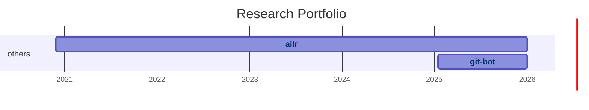

{: .text-center}

```mermaid
---
displayMode: compact
---
gantt
title Research Portfolio
dateFormat YYYY-MM-DD
axisFormat %Y

    section work_practices

    section distributed_organizing

    section knowledge_synthesis

    section others
        git-bot :git-bot, 2025-01-15, 2026-01-02
        ailr :ailr, 2020-11-26, 2026-01-02


    click git-bot href "{{ site.baseurl }}/docs/10-lab/18-resources/git-bot.html"
    click ailr href "{{ site.baseurl }}/docs/10-lab/18-resources/ailr.html"
```
