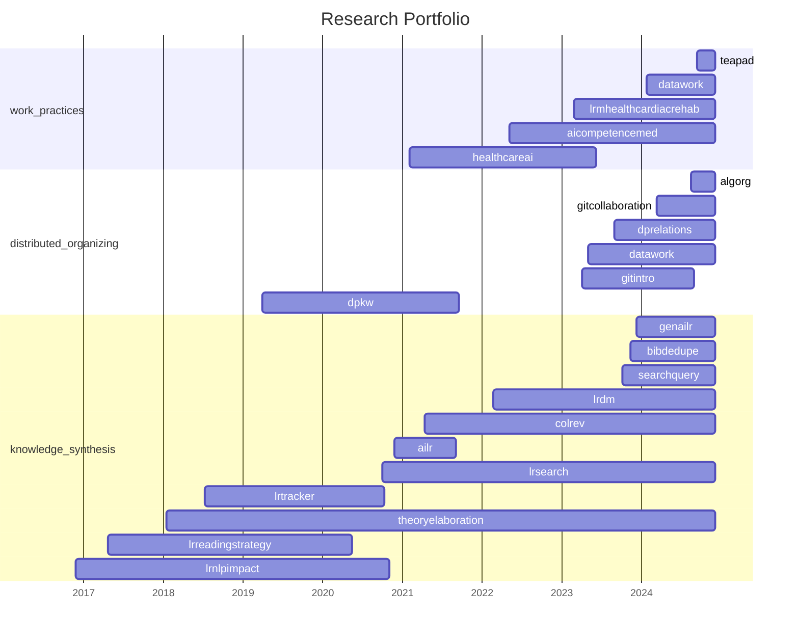

{: .text-center}

```mermaid
gantt
    title Research Portfolio
    dateFormat YYYY-MM-DD
    axisFormat %Y
    
    section work_practices
        teapad :a1, 2024-09-10, 2024-12-04
        datawork :a1, 2024-01-25, 2024-12-04
        lrmhealthcardiacrehab :a1, 2023-02-26, 2024-12-04
        aicompetencemed :a1, 2022-05-06, 2024-12-04
        healthcareai :a1, 2021-02-03, 2023-06-10

    section distributed_organizing
        algorg :a1, 2024-08-14, 2024-12-04
        gitcollaboration :a1, 2024-03-13, 2024-12-04
        dprelations :a1, 2023-09-01, 2024-12-04
        datawork :a1, 2023-05-04, 2024-12-04
        gitintro :a1, 2023-04-04, 2024-08-28
        dpkw :a1, 2019-04-02, 2021-09-18

    section knowledge_synthesis
        genailr :a1, 2023-12-10, 2024-12-04
        bibdedupe :a1, 2023-11-11, 2024-12-04
        searchquery :a1, 2023-10-04, 2024-12-04
        lrdm :a1, 2022-02-20, 2024-12-04
        colrev :a1, 2021-04-15, 2024-12-04
        ailr :a1, 2020-11-26, 2021-09-02
        lrsearch :a1, 2020-10-01, 2024-12-04
        lrtracker :a1, 2018-07-12, 2020-10-12
        theoryelaboration :a1, 2018-01-15, 2024-12-04
        lrreadingstrategy :a1, 2017-04-22, 2020-05-17
        lrnlpimpact :a1, 2016-11-27, 2020-11-04
```
