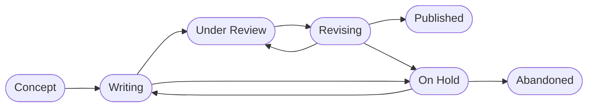

# 25 Projects
{: .d-inline-block }

<table>
  <thead>
    <tr>
      <th>Project</th>
      <th>Status</th>
    </tr>
  </thead>
  <tbody>
    
    <tr>
      <td><a href="{{ site.baseurl }}{{ project.url }}">{{ project.title }}</a></td>
      <td>{{ project.status }}</td>
    </tr>
    
  </tbody>
</table>

{: .text-center}

{: .confidential } 
> Confidential project data are stored here:
> 
> - [GitHub](https://github.com/orgs/digital-work-lab/repositories?q=topic%3Aresearch){: target="_blank"}
> - [Nextcloud](https://nc-2272638881871040784.nextcloud-ionos.com/index.php/apps/files/?dir=/20-research/25_projects&fileid=88094){: target="_blank"}
