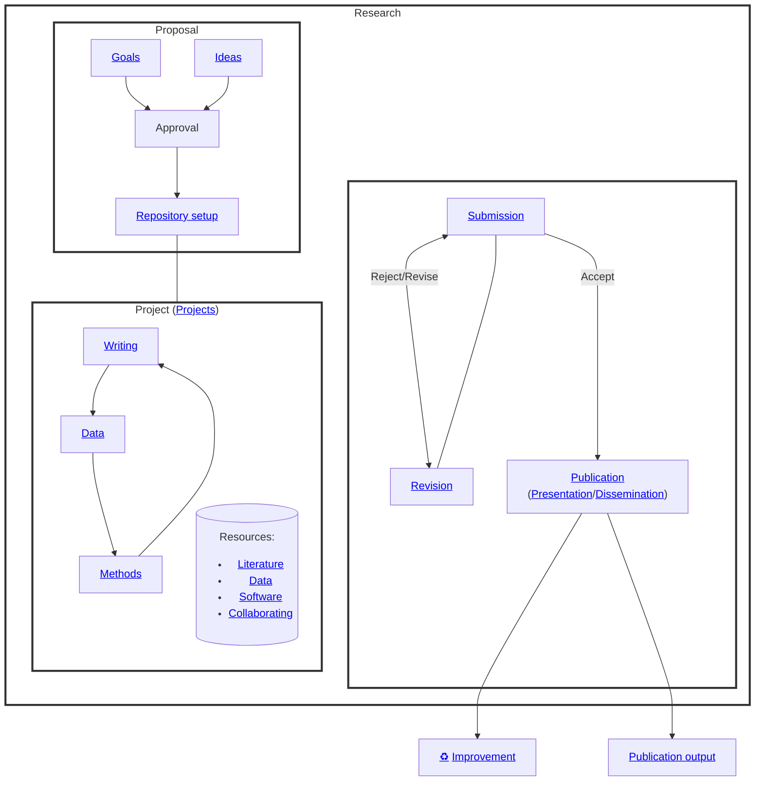

# Research

<!-- TODO: Cover Research data management, reproducibility (but check with the team before publishing data - make sure confidential data is protected) -->

{: .text-center}

```mermaid
flowchart TB
    subgraph Research
        subgraph Proposal
            direction TB
            Goals["<a href='20_processes/20.01.goals.html'>Goals</a>"] --> Approval
            Ideas["<a href='20_processes/20.09.ideas.html'>Ideas</a>"] --> Approval
            Approval --> Setup["<a href='20_processes/20.15.repo-setup.html'>Repository setup</a>"]
        end

        Setup --- a
        subgraph b[" "]
            direction TB
            Submission["<a href='20_processes/20.30.pre-submission.html'>Submission</a>"] <-->|Reject/Revise| Revise["<a href='20_processes/20.32.revision.html'>Revision</a>"]
            Revise --- Submission
            Submission -->|Accept| Publication["<a href='20_processes/20.33.publication.html'>Publication</a><br>(<a href='20_processes/20.28.presentation.html'>Presentation</a>/<a href='20_processes/20.34.dissemination.html'>Dissemination</a>)"]
        end
        subgraph a["Project (<a href='25-projects.html'>Projects</a>)"]
            direction TB
            Writing["<a href='20_processes/20.29.writing.html'>Writing</a>"] --> Data
            Methods["<a href='20_processes/20.18.methods.html'>Methods</a>"] --> Writing
            Data["<a href='20_processes/20.17.data.html'>Data</a>"] --> Methods
            Resources[("Resources:<br><ul><li><a href='22-literature.html'>Literature</a></li><li><a href='23-data.html'>Data</a></li><li><a href='24-software.html'>Software</a></li><li><a href='20_processes/20.16.collaboration.html'>Collaborating</a></li></ul>")]
        end

    end
    Publication --> Improvement["<a href='../10-lab/10_processes/10.01.goals.html'>♻️</a> <a href='20_processes/20.35.improvement.html'>Improvement</a>"]

    Publication --> PublicationOutput["<a href='29-publications.html'>Publication output</a>"]

    style Proposal fill:white,stroke:#333,stroke-width:3px
    style Research fill:white,stroke:#333,stroke-width:3px
    style a fill:white,stroke:#333,stroke-width:3px
    style b fill:white,stroke:#333,stroke-width:3px

```
