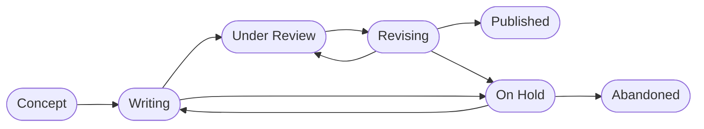

# Research

Projects are in [25-Projects](25-projects.html) and can be in the following states:

{: .text-center}

<!-- TODO: Cover Research data management, and reproducibility (but check with the team before publishing data - make sure confidential data is protected) -->

## Concept

- [Goals](20_processes/20.01.goals.html)
- [Ideas](20_processes/20.09.ideas.html)
- Selection
- [Repository setup](20_processes/20.15.repo-setup.html)

## Writing

- [Collaboration](20_processes/20.16.collaboration.html)
- [Writing](20_processes/20.29.writing.html)
- [Methods](20_processes/20.18.methods.html)
- [Data](20_processes/20.17.data.html) - [Data](23-data.html)
- [Literature](22-literature.html)
- [Softare](24-software.html)
- [Submission](20_processes/20.30.pre-submission.html)

## Under Review

## Revising

- [Revision](20_processes/20.32.revision.html)

## On Hold

## Abandoned

## Published

- <a href='{{ site.baseurl }}/docs/00.goals.html'>♻️</a> <a href='20_processes/20.35.improvement.html'>Improvement</a>
- [Publication](20_processes/20.33.publication.html)
- [Presentation](20_processes/20.28.presentation.html)
- [Dissemination](20_processes/20.34.dissemination.html)
- [Publication Output](29-publications.html)
