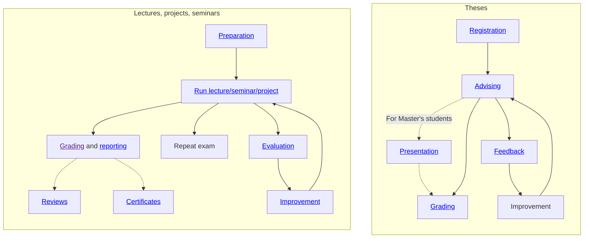

# 30.02 Courses

## Process

## Course list

**Semester** | **Courses offered** | **Status** |
--- | --- | --- |
Winter 2024/25 | Lecture: Introduction into Information Systems | ⟳ |
Winter 2024/25 | [WI-Project: Open Source Development](../33_projects/33.04.osd-ws24-25.html) | ⟳ |
Winter 2024/25 | [The Literature Review Seminar](../34_seminars/34.04.lrsem-ws25-25.html) | ⟳ |
Winter 2024/25 | [Theses](../35_theses.html) | ⟳ |
Summer 2024 | [Lecture: Introduction to Digital Work](../32_lectures/32.02.idw-ss24.html) | ▶ |
Summer 2024 | [WI-Project: Open Source Development](../33_projects/33.03.osd-ss24.html) | ▶ |
Summer 2024 | [The Literature Review Seminar](../34_seminars/34.03.lrsem-ss24.html) | ▶ |
Summer 2024 | [Theses](../35_theses.html) | ▶ |
Winter 2023/24 | [WI-Project: Open Source Development](../33_projects/33.02.osd-ws23-24.html) | ✔️ |
Winter 2023/24 | [The Literature Review Seminar](../34_seminars/34.02.lrsem-ws23-24.html) | ✔️ |
Winter 2023/24 | [Theses](../35_theses.html) | ✔️ |
Summer 2023 | [Lecture: Introduction to Digital Work](../32_lectures/32.01.idw-ss23.html) | ✔️ |
Summer 2023 | [WI-Project: Open Source Development](../33_projects/33.01.osd-ss23.html) | ✔️ |
Summer 2023 | [Theses](../35_theses.html) | ✔️ |
Winter 2022/23 | [The Literature Review Seminar](../34_seminars/34.01.lrsem-ws22-23.html) | ✔️ |
Winter 2022/23 | [Theses](../35_theses.html) | ✔️ |

[➕ lecture](30.10.lecture.html) [➕ project](30.12.projects.html) [➕ seminar](30.11.seminars.html)
{: .text-center }

Status

- ⟳ in-preparation
- ▶ in-progress
- 📋 grade / review / repeat exams
- ✔️ completed
