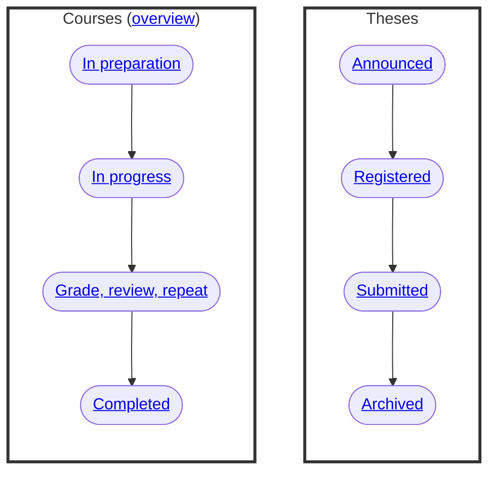

# Teaching

Our teaching activities include lectures, projects, and seminars, which are based on the following process:

{: .text-center}

## Courses

[Overview](30_processes/30.02.courses.html)

### In preparation

- [FlexNow](30_processes/30.15.flexnow.html) to [create a new module](30_processes/30.09.new_modules.html)
- [UnivIS](30_processes/30.16.univis.html) to announce courses

### In progress

- [VC](30_processes/30.19.virtual_campus.html) for student communication
- [Pedagogy](30_processes/30.07.pedagogy.html) <a href='.{{ site.baseurl }}/docs/00.goals.html'>🛠️</a>
- [Evaluations](30_processes/30.21.evaluations.html)

### Grade, review, repeat

- [Exams, repeat exams](30_processes/30.59.exams.html)
- [FlexNow](30_processes/30.15.flexnow.html) to enter grades
- [Report](30_processes/30.20.reports.html)
- [Reviews](30_processes/30.60.reviews.html)
- [Certificates](30_processes/30.51.certificates.html)
- [Improvements](30_processes/30.22.improvements.html) "<a href='.{{ site.baseurl }}/docs/00.goals.html'>♻️</a> 

### Completed

## Theses

[Thesis page](https://digital-work-lab.github.io/theses/)

{: .highlight }
> **TODO**: private thesis page

### Announced

- [Registration](30_processes/30.40.theses.html#registration)

### Registered

- [Advising](30_processes/30.40.theses.html#advising)

### Submitted

- [Grading](30_processes/30.40.theses.html#grading)
- [Feedback](https://digital-work-lab.github.io/theses/docs/feedback.html)
- [Improvement](30_processes/30.22.improvements.html) "<a href='.{{ site.baseurl }}/docs/00.goals.html'>♻️</a> 

### Archived
