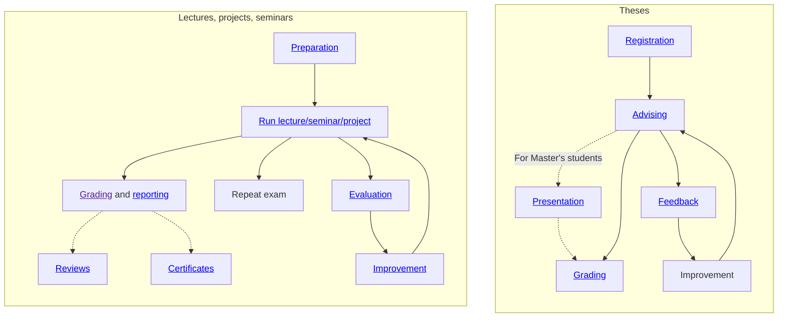

# Teaching

```mermaid
flowchart TB
    subgraph Theses
        direction TB
        Registration["<a href='30_processes/30.40.theses.html#registration'>Registration</a>"] --> Advising["<a href='30_processes/30.40.theses.html#advising'>Advising</a>"]
        Advising -. For Master's students .-> Presentation["<a href='30_processes/30.40.theses.html#thesis-presentation'>Presentation</a>"]
        Presentation -.-> Grading
        Advising --> Grading["<a href='30_processes/30.40.theses.html#grading'>Grading</a>"]
        Advising --> Feedback["<a href='https://digital-work-lab.github.io/theses/docs/feedback.html'>Feedback</a>"]
        Improvement --> Advising
        Feedback --> Improvement
    end

    subgraph main["Lectures, projects, seminars"]
        direction TB
        Prepare["<a href='30_processes/30.09.new_modules.html'>Preparation</a>"] --> Run["<a href='30_processes/30.02.courses.html#course-list'>Run lecture/seminar/project</a>"]
        Run --> Grade["<a href=''>Grading</a> and <a href='30_processes/30.20.reports.html'>reporting</a>"]
        Run --> Repeat[Repeat exam]
        Grade -.-> Reviews["<a href='30_processes/30.60.reviews.html'>Reviews</a>"]
        Grade -.-> Certificates["<a href='30_processes/30.51.certificates.html'>Certificates</a>"]
        Run --> Evaluate["<a href='30_processes/30.21.evaluations.html'>Evaluation</a>"]
        Evaluate --> Improve["<a href='30_processes/30.22.improvements.html'>Improvement</a>"]
        Improve --> Run
    end

```