```mermaid
flowchart TB
    subgraph Theses
        direction TB
        Registration["<a href='30_processes/30.40.theses.html#registration'>Registration</a>"] --> Advising["<a href='30_processes/30.40.theses.html#advising'>Advising</a>"]
        Advising -. Master's students .-> Presentation["<a href='30_processes/30.40.theses.html#thesis-presentation'>Presentation</a>"]
        Presentation -.-> Grading
        Advising --> Grading["<a href='30_processes/30.40.theses.html#grading'>Grading</a>"]
        Advising --> Feedback["<a href='https://digital-work-lab.github.io/theses/docs/feedback.html'>Feedback</a>"]
        Improvement["<a href='.{{ site.baseurl }}/docs/00.goals.html'>♻️</a> <a href='30_processes/30.22.improvements.html'>Improvement</a>"] --> Advising
        Feedback --> Improvement
    end
    style Theses fill:white,stroke:#333,stroke-width:3px

```

# Teaching

Our teaching activities include lectures, projects, and seminars, which are based on the following process:

{: .text-center}

{: .text-center}

```mermaid
flowchart TB
    subgraph main["Lectures, projects, seminars"]
        direction TB

        FlexNow[("<a href='30_processes/30.15.flexnow.html'>FlexNow</a>")]
        FlexNow --- Prepare
        FlexNow --- Grade
        UnivIS[("<a href='30_processes/30.16.univis.html'>UnivIS</a>")]
        UnivIS --- Prepare
        VC[("<a href='30_processes/30.19.virtual_campus.html'>VC</a>")] --- Run

        Prepare["<a href='30_processes/30.09.new_modules.html'>New module</a>"] --> Run["<a href='30_processes/30.02.courses.html#course-list'>Run lecture/seminar/project</a>"]
        Run --> Grade["<a href='30_processes/30.59.exams.html'>Exams, repeat exams</a>, <a href=''>Grading</a>, <a href='30_processes/30.20.reports.html'>Reporting</a>"]
        Pedagogy["<a href='.{{ site.baseurl }}/docs/00.goals.html'>🛠️</a> <a href='30_processes/30.07.pedagogy.html'>Pedagogy</a>"] --- Run
        Grade -.-> Reviews["<a href='30_processes/30.60.reviews.html'>Reviews</a>"]
        Grade -.-> Certificates["<a href='30_processes/30.51.certificates.html'>Certificates</a>"]
        Run ==> Evaluate["<a href='30_processes/30.21.evaluations.html'>Evaluation</a>"]
        Evaluate ==> Improve["<a href='.{{ site.baseurl }}/docs/00.goals.html'>♻️</a> <a href='30_processes/30.22.improvements.html'>Improvement</a>"]
        Improve ==> Run
    end
    style main fill:white,stroke:#333,stroke-width:3px

```

In addition, we advise Bachelor's and Master's theses based on the following process:

{: .text-center}

