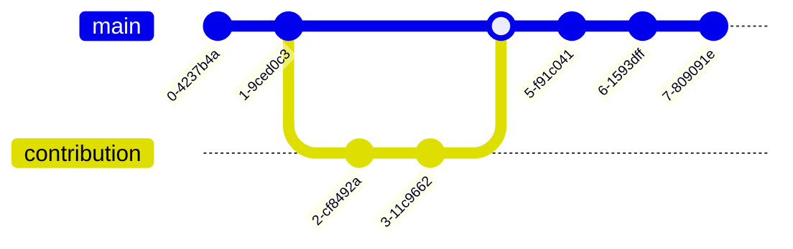

# Contributing to the handbook

This page explains how to contribute to the handbook.

<!--
{: .highlight }
A paragraph highlighted as a warning

[VC](https://vc.uni-bamberg.de/course/view.php?id=58270){: .btn .btn-blue }

## Contributing via git

-->

## Maintainers

| Section    | Maintained by |
|------------|---------------|
| lab_basics | [@geritwagner](https://github.com/geritwagner)  |
| research   | [@geritwagner](https://github.com/geritwagner)  |
| teaching   | [@geritwagner](https://github.com/geritwagner)  |

## Deployment

The handbook is hosted on GitHub pages. The deployment may take a few minutes. You can check the status at 

[GitHub](https://github.com/digital-work-lab/handbook/actions){: .btn .btn-green }

