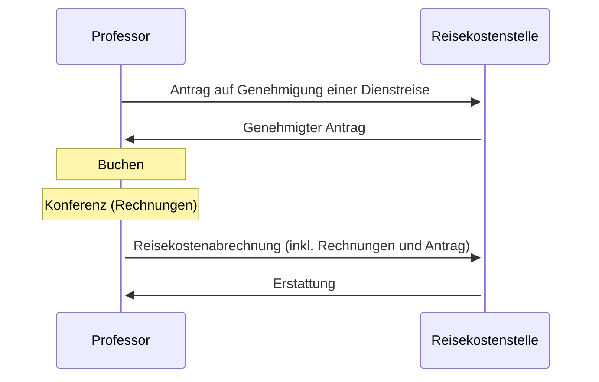

# Dienstreise

- [Dienstreiseantrag](https://www.uni-bamberg.de/fileadmin/abt-personal/Homepage_ab_2016-03/11_Formulare_Infos_Merkblaetter/Reisekosten/Antrag_auf_Genehmigung_einer_Dienstreise.pdf)

