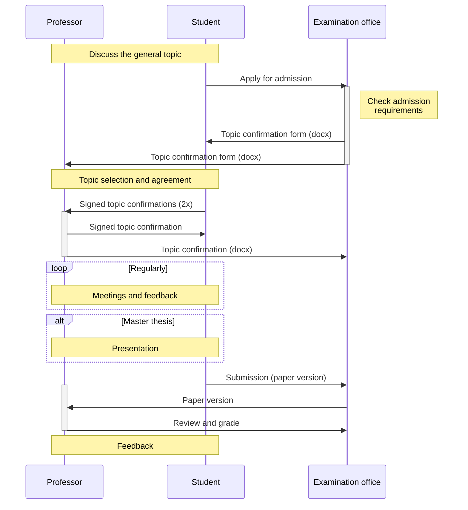

# Theses: The process

```mermaid
sequenceDiagram
    Note over Professor,Student: Discuss the general topic
    Student->>Examination office: Apply for admission
    activate Examination office
    Note right of Examination office: Check admission<br/>requirements
    Examination office->>Student: Topic confirmation form (docx)
    Examination office->>Professor: Topic confirmation form (docx)
    deactivate Examination office
    Note over Professor,Student: Topic selection and agreement
    Student->>Professor: Signed topic confirmations (2x)
    activate Professor
    Professor->>Student: Signed topic confirmation
    Professor->>Examination office: Topic confirmation (docx)
    deactivate Professor
    loop Regularly
        Note over Professor,Student: Meetings and feedback
    end
    alt Master thesis
        Note over Professor,Student: Presentation
    end
    Student->>Examination office: Submission (paper version)
    activate Professor
    Examination office->>Professor: Paper version
    Professor->>Examination office: Review and grade
    deactivate Professor
    Note over Professor,Student: Feedback
```
