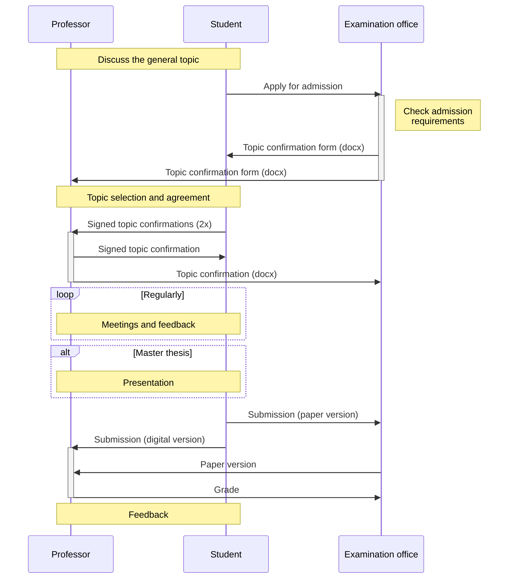

# Theses

Writing a theses involves several steps.

We offer regular feedback sessions (in person or online):

[Schedule feedback session](https://calendly.com/gerit-wagner/30min){: .btn .btn-green }

[Apply for admission](mailto:wiai.pruefungen@uni-bamberg.de?subject=Bachelorarbeit%20Anmeldung&body=Sehr%20geehrte%20Damen%20und%20Herren%2C%0A%0Ahiermit%20stelle%20ich%20einen%20Antrag%20zur%20Anmeldung%20meiner%20Bachelorarbeit.%0A%0AAktuelle%20Anschrift%3A%0A...%0A%0AAnschrift%20nach%20Abschluss%20des%20Studiums%3A%0A...%0A%0AMatrikelnummer%3A%20XXXX%0A%0AStudiengang%3A%20Bachelor%20Wirtschaftsinformatik%0A%0AE-Mail-Adresse%3A%20...%0A%0ABetreuer%3A%20Herr.%20Prof.%20Dr.%20Gerit%20Wagner%0ALehrstuhl%3A%20Digital%20Work%0A%0AMit%20freundlichen%20Gr%C3%BC%C3%9Fen%0A%0A...%20){: .btn .btn-green }
