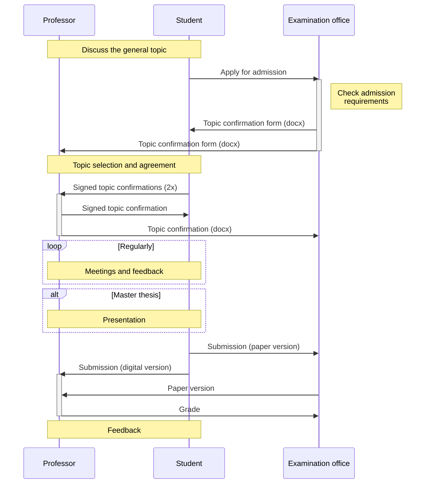

# Theses

Writing a theses involves several steps.

We offer regular feedback sessions (in person or online):

[Schedule feedback session](https://calendly.com/gerit-wagner/30min){: .btn .btn-green }

